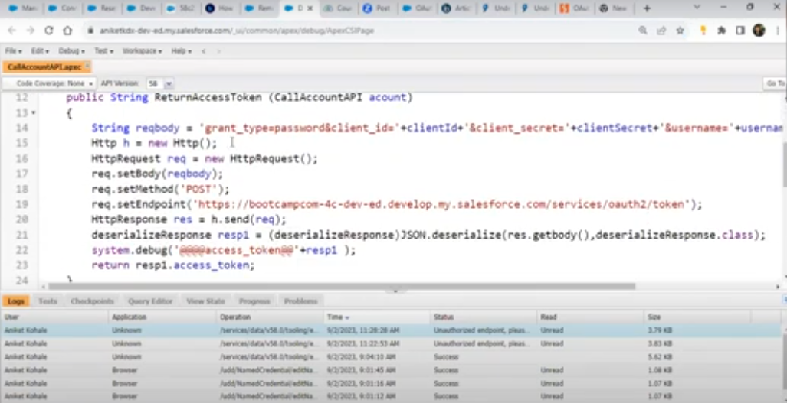

<h1>Contributor : Priyanka Ghiya </h1>
NOTE:  
> <b>Remote Site Setting and Named Credentials are used when we want to hit some external api and get the data inside Salesfroce </b>  
> <b>Connected Apps are used when External APIS hits to our Saelsforce Org ie. inside the Apex Class with RestResource and URL Mapping, for performing operations on Salesforce Data.</b>  
> For Generating the Access Token, we require the Authentication Parameter for the Third Party System Integration with Our Salesforce System we need the following :   
1. Username : from the salesforce org we can get.  
2. Password : logged in users password.  
3.Security Token : we can get from the user icons Setting feature.  
It is used when any third party external system wants to access the data from Salesforce, it is append along with the password for security purpose and everytime we reset the org password it is also reset.  
4. Consumer Key  
5. Secret Key  
both of this key we will receive from the connected app, which we have created.   
> Once we get the Access Token, it will be used to Authorize the Endpoint URL.  
   
> In the postman, we will be including these parameters as shown in the img.
but For post url you will need to search for access url in developer guide and replace your url till '.com'  
Also, for password parameter, first include the password and after that append the security token. 
once,you hit send you will receive the ACCESS TOKEN as shown in the img. 
  

> Copy that access token from postman.  
> Get the Endpoint URL ie. anything.com/serives/apexrest/urlmappingName. 
> Navigate to postMan, in the header parameter use the Authorization as per the img. 
  
> As value to the Authorization use the 'bearer ', keyword and append the access token generated in the previous post call in postman. Refer image. 
  

> An Apex Class Example for all these procedure using apex code for future refernce. 
  
  
  

# sfdc-integration-bootcamp

1. **Salesforce Integration Bootcamp Assignments:** https://bit.ly/3paK9E5
2. **Salesforce Integration Bootcamp Slides:** https://bit.ly/41b6C12
3. **Salesforce Integration Bootcamp Notes:** https://bit.ly/44BeNXp
4. **Salesforce Integration Bootcamp Sheet:** https://bit.ly/3pktVs6

**Session #1: 13th May 2023**
- What is Integration?
- Integration Terminologies 
- What is Webservices?
- JSON Fundamentals using Apex
- REST API Fundamentals - REST Callouts & REST Services using Apex
- Postman Tool Fundamentals

**Session #2: 03rd June 2023**
- Authentication Fundamentals
- Authentication in REST API
- Connected Apps
- Auth Providers
- Username and Password Based Authentication in REST API's
- Named Credentials

**Session #3: TBD**
- Implementation of OAuth 2.0
- Implementation of JWT

**Session #4: TBD**
- Fundamentals of Integration Patterns
- Implementation of Integration Patterns
- Integration Best Practices
- Integration Framework/Integration Design Patterns in Apex

